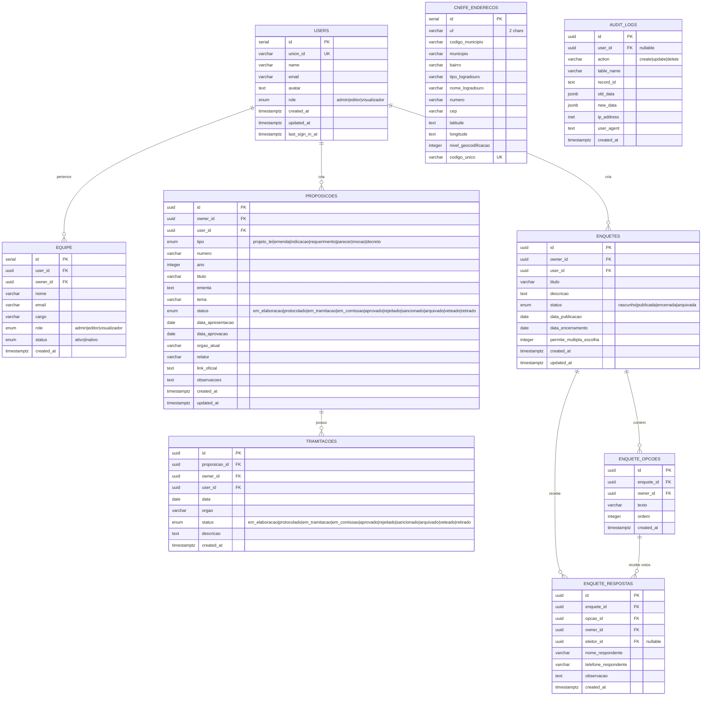

<!-- 20/05/2026 - Diagrama ER do banco de dados -->

# Diagrama ER — Mandato Digital

## Notas de Modelagem

- **Soft delete:** Nenhuma tabela tem soft delete explícito. `equipe.status` e `enquetes.status` funcionam como flags de ativação.
- **Multi-tenancy:** `owner_id` em quase todas as tabelas garante isolamento entre mandatos.
- **Audit trail:** `audit_logs` registra todas as operações CREATE/UPDATE/DELETE com JSONB do estado anterior e novo.
- **CNEFE:** Tabela independente, sem FKs — dados do IBGE importados em batch.
