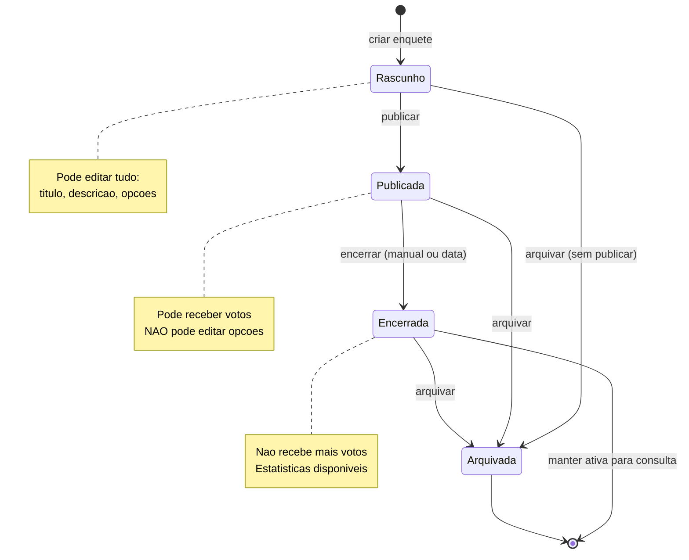
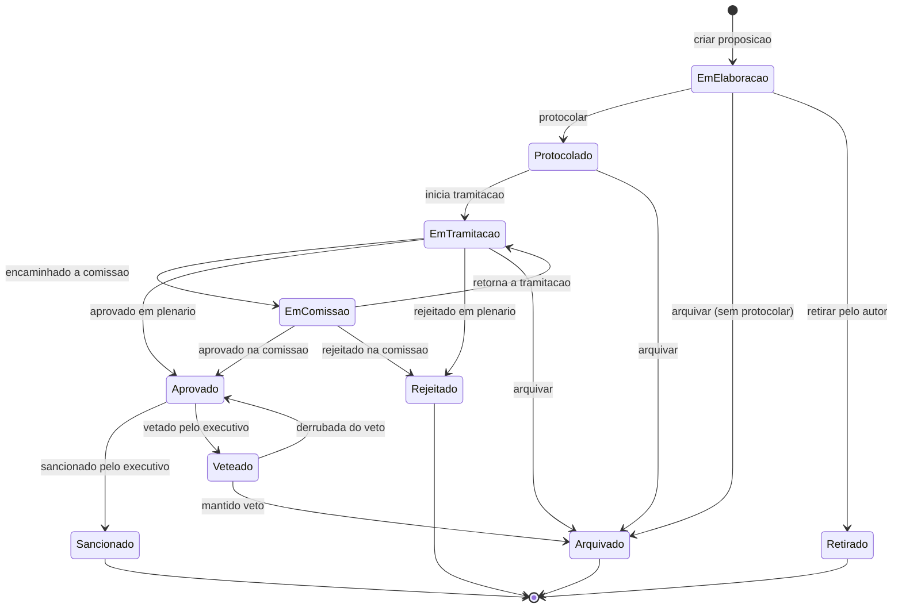
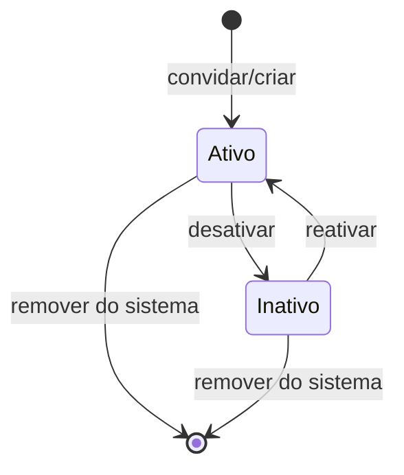
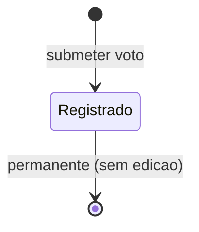

<!-- 20/05/2026 - Diagramas de estado das entidades -->

# Diagramas de Estado — Mandato Digital

## Enquete

**Transicoes invalidas:**
- `Publicada → Rascunho` (nao permitido — votos ja existem)
- `Encerrada → Publicada` (nao permitido — reabrir enquete)
- `Arquivada → qualquer` (nao permitido — estado final)

---

## Proposicao

**Transicoes invalidas:**
- `Sancionado → qualquer` (nao permitido — promulgada)
- `Rejeitado → Aprovado` (nao permitido — nova proposicao necessaria)
- `Arquivado → qualquer` (nao permitido — estado final)

---

## Membro da Equipe

---

## Resposta de Enquete (Voto)

**Regra:** Votos sao imutaveis. Nao ha edicao ou exclusao.
